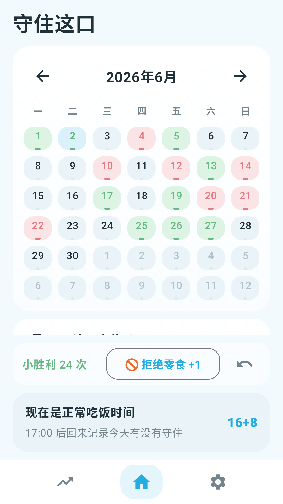
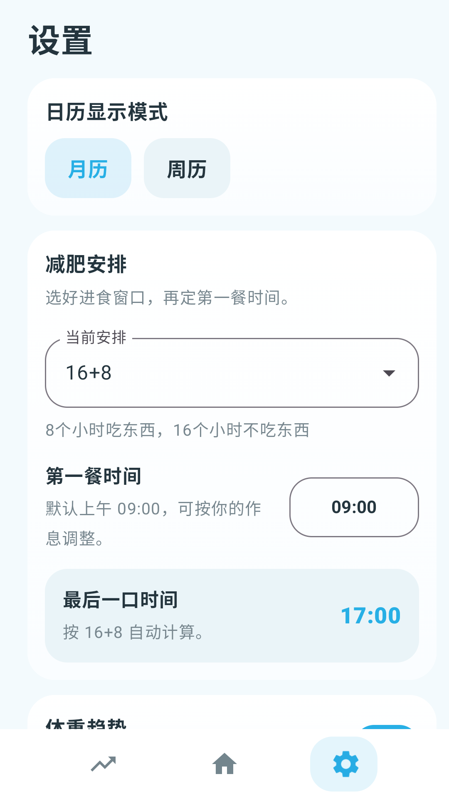
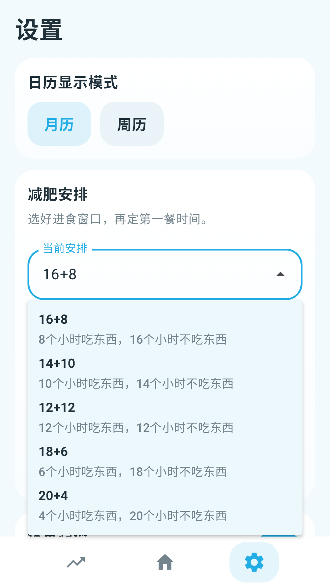
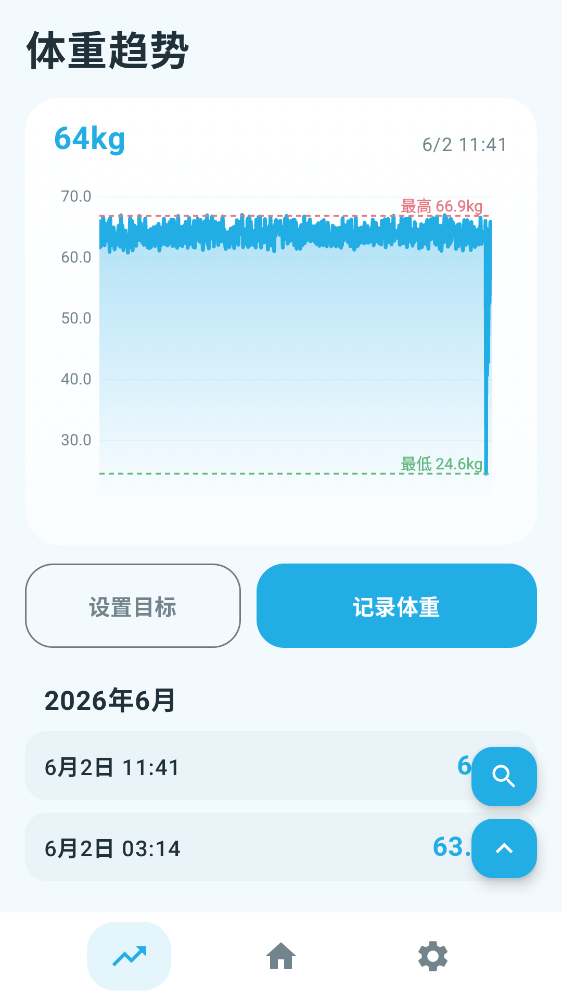

# 守住这口

一个很简单的限时进食打卡 App。

它不讲大道理，也不催你做得完美。每天就看一件事：这口有没有守住。

## 截图

<table>
  <tr>
    <td align="center">
      
      <br />
      <sub>主页</sub>
    </td>
    <td align="center">
      
      <br />
      <sub>设置</sub>
    </td>
    <td align="center">
      
      <br />
      <sub>减肥安排</sub>
    </td>
    <td align="center">
      
      <br />
      <sub>体重趋势</sub>
    </td>
  </tr>
</table>

## 这个 App 用来做什么

`守住这口` 适合用来记录 16+8、14+10、12+12、18+6、20+4 这类限时进食安排里的日常打卡。

你可以把一天简单记成两种状态：

- `守住了`：今天守住了自己的进食窗口。
- `没守住`：今天没有守住，也没关系，记下来就好。

它更像一个轻量日历，不是复杂计划表。打开、点一下、记一下，就结束。

## 怎么用

1. 每天打开 App。
2. 非进食时间里拒绝了一次零食，可以点 `拒绝零食 +1`，记下一次小胜利。
3. 进食窗口内正常吃饭，App 会提示最后一口时间，先不急着最终打卡。
4. 进入禁食窗口后，如果今天守住了自己设置的安排，点 `守住了`。
5. 如果没守住，点 `没守住`。
6. 想补一句备注，就在弹窗里写一点；不想写也可以跳过。
7. 如果你想顺便看体重变化，可以在设置里打开 `体重趋势`。

`拒绝零食 +1` 只是记录过程里的小胜利，不会直接把今天改成 `守住了` 或 `没守住`。

如果某一天忘记打卡，回看历史时会先按 `默认守住了` 展示；如果那天其实没守住，可以选中那天再改。

## 体重记录

体重功能是可选的。

打开后，底部会多一个趋势页，可以记录体重、看曲线，也可以设置一个目标体重参考线。

不想看体重的话，关掉就行。主流程还是每天打卡。

## 设置里能调什么

- 日历显示：月历 / 周历。
- 显示模式：跟随手机 / 浅色 / 夜间。
- 减肥安排：选择 16+8、14+10、12+12、18+6、20+4。
- 第一餐时间：默认上午 9 点，自动算出最后一口时间。
- 体重趋势：是否显示趋势页。
- 体重单位：kg / 斤。
- 打卡后询问体重：打卡时顺便补体重，或者完全跳过。

## 隐私协议和匿名统计

App 首次打开时会显示隐私政策 / 用户协议。核心数据还是本地记录：打卡、体重、备注这些内容默认保存在你的设备里。

里面接入了友盟+移动统计。坦白说，我一开始也不知道友盟具体是啥，是 AI 推荐了这个方案，对接过程也主要由 AI 助手完成。接它的目的很简单：看看大概有多少人在用、每天打开几次、哪些功能有人点，比如 `守住了`、`没守住`、`拒绝零食 +1`、`体重趋势` 这类功能使用频率。

统计不会主动上传你的体重数值、饮食内容或备注文本；也不收集精确位置、不读取应用列表。隐私政策里会把这些限制写出来。如果你觉得这块有不合适、不清楚或需要改的地方，欢迎提 issue 或直接反馈，我会优先处理。

## 安装包

本地 release 包生成后在：

```text
app/build/outputs/apk/release/hold-that-bite-0.4.0-release.apk
```

如果手机或模拟器里已经装过 debug 版本，可能需要先卸载旧版本再安装 release 版本。

## 一句话

限时进食不需要每天都很英勇。这个 App 只是帮你把“今天守住了吗”轻轻记下来。

## 首发

程序首发至 [Linux.do](Linux.do) ，如果有好的想法和意见建议，欢迎在社区内反馈或写issus
