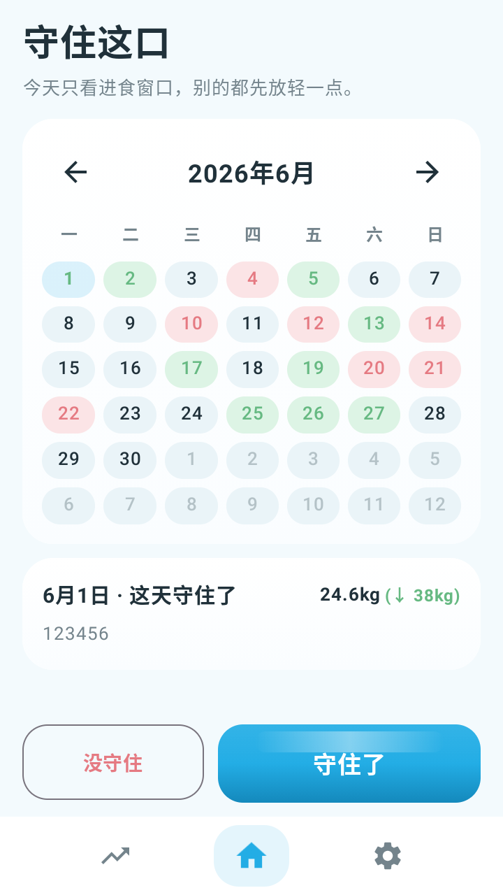
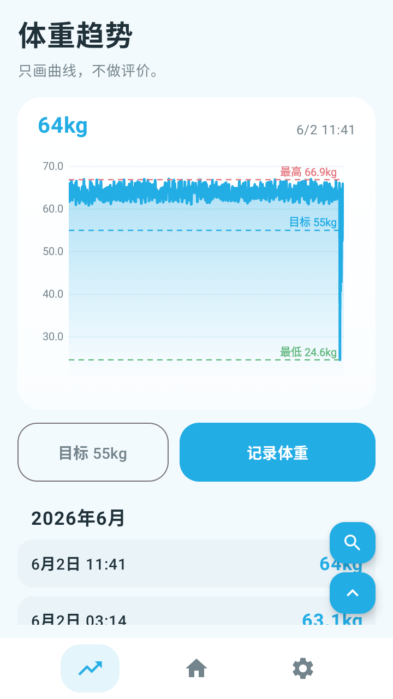
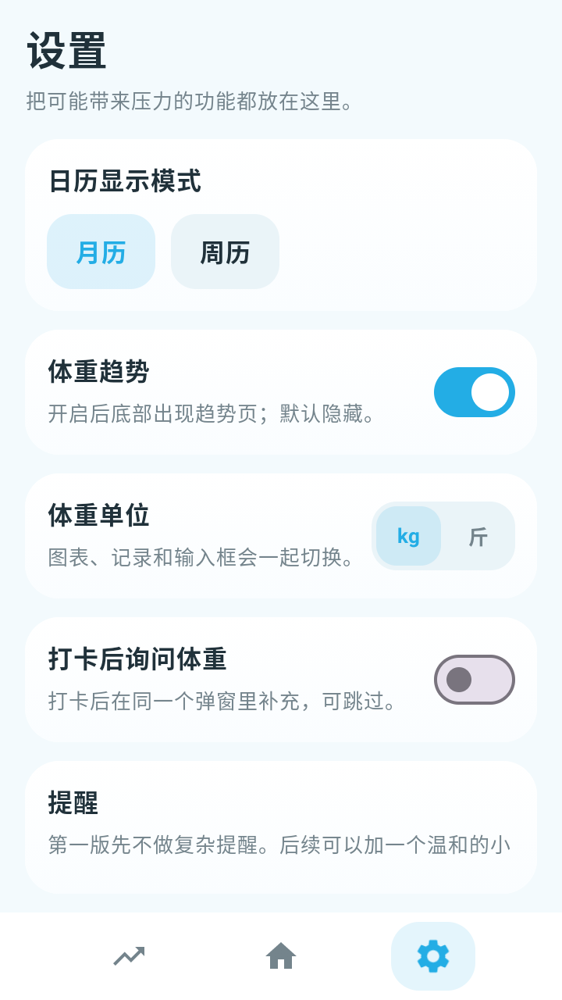

# Hold That Bite 截图记录

记录时间：2026-06-01

## 环境

- 应用版本：0.2.0
- 包名：`com.holdthatbite`
- 截图设备：Android 12，720x1280，density 320
- 安装包：`app/build/outputs/apk/debug/app-debug.apk`

## 截图

### 主页日历

展示主界面的月历、当天记录摘要与底部打卡入口。



### 守住了胜利弹窗

点击 `守住了` 后展示胜利卡片，包含标题动效区域、备注输入和确认操作。


### 体重趋势

展示体重趋势页、目标线、最高/最低辅助线和体重记录入口。



### 设置页

展示日历模式、体重趋势开关、体重单位与打卡后补充体重配置。



## 验证记录

已在本地使用仓库内 Gradle 缓存路径完成验证：

```powershell
$env:JAVA_HOME='C:\Program Files\Android\Android Studio\jbr'
$env:ANDROID_HOME='D:\AndroidSDK'
$env:ANDROID_SDK_ROOT='D:\AndroidSDK'
$env:GRADLE_USER_HOME='D:\code\hold-that-bite\.gradle-home'
.\gradlew.bat --no-daemon --max-workers=1 testDebugUnitTest
.\gradlew.bat --no-daemon --max-workers=1 assembleDebug
```

结果：`testDebugUnitTest` 与 `assembleDebug` 均为 `BUILD SUCCESSFUL`。
